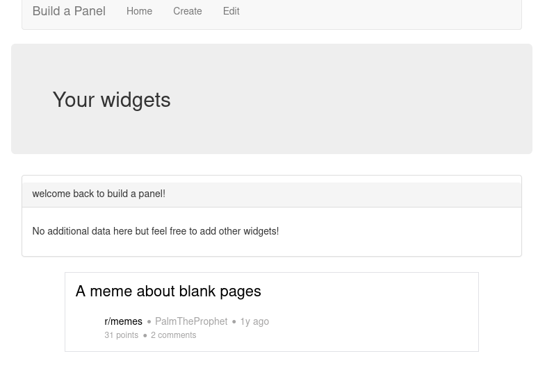
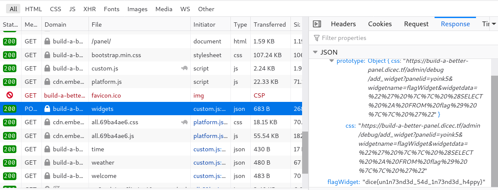

# Build a Better Panel

**Category**: Web \
**Points**: 299 (13 solves) \
**Author**: Jim

## Challenge

BAP wasn't secure enough. Now the admin is a bit smarter, see if you can still
get the flag! If you experience any issues, send it
[here](https://us-east1-dicegang.cloudfunctions.net/ctf-2021-admin-bot?challenge=build-a-better-panel)

NOTE: The admin will only visit sites that match the following regex
`^https:\/\/build-a-better-panel\.dicec\.tf\/create\?[0-9a-z\-\=]+$`

Site: [build-a-better-panel.dicec.tf](build-a-better-panel.dicec.tf) \
Attachments: `build-a-better-panel.tar.gz`

## Solution

Solved with ath0.

This is nearly identically to [Build a Panel](../build_a_panel) except:
- The `panelId` cookie is `sameSite: 'strict'` instead of `'lax'`
- The admin bot only goes to `/create`

Instead of directly giving the admin bot a URL that triggers SQL injection, we
have to make a `/create` page that requests that URL.

Looking at the `/create` route we have:
```javascript
app.get('/create', (req, res) => {
    const cookies = req.cookies;
    const queryParams = req.query;

    if(!cookies['panelId']){
        const newPanelId = queryParams['debugid'] || uuidv4();
        console.log(newPanelId);

        res.cookie('panelId', newPanelId, {maxage: 10800, httponly: true, sameSite: 'lax'});
    }

    res.redirect('/panel/');
});
```

We can specify a `debugid` so that the admin bot goes to a specific panel.

Now we have to craft a panel that sends the SQL injection request.
For reference, this is what a default panel looks like:



Looking at `app/public/cusotm.js`, we see a prototype pollution vulnerability here:
```javascript
const mergableTypes = ['boolean', 'string', 'number', 'bigint', 'symbol', 'undefined'];

const safeDeepMerge = (target, source) => {
    for (const key in source) {
        if(!mergableTypes.includes(typeof source[key]) && !mergableTypes.includes(typeof target[key])){
            if(key !== '__proto__'){
                safeDeepMerge(target[key], source[key]);
            }
        }else{
            target[key] = source[key];
        }
    }
}

const displayWidgets = async () => {
    const userWidgets = await (await fetch('/panel/widgets', {method: 'post', credentials: 'same-origin'})).json();
    let toDisplayWidgets = {'welcome back to build a panel!': {'type': 'welcome'}};

    safeDeepMerge(toDisplayWidgets, userWidgets);

    ...
};
```

We can bypass the `__proto__` check in `safeDeepMerge` by using
`constructor.prototype` instead, which is the same thing.

Some googling brings up a
[related exploit](https://github.com/BlackFan/client-side-prototype-pollution/blob/master/gadgets/embedly.md)
on [embedly](https://embed.ly/), the service used to show the reddit card at the
bottom of the page. The exploit allows us to inject any attribute to the
`iframe` of the reddit card.

The linked exploit uses `onload="alert(1)"`, but that didn't work for this
challenge due to the Content Security Policy:
- `default-src 'none';`
- `script-src 'self' http://cdn.embedly.com/;`
  - Prevents inline JavaScript from executing
- `style-src 'self' http://cdn.embedly.com/;`
- `connect-src 'self' https://www.reddit.com/comments/;`

We read through embedly's `platform.js` script for variables to pollute and
managed to discover some interesting tricks, but failed to find anything that
could make the desired SQL injection request. After being stuck for hours, we
were ready to give up.

But in the last 30 minutes of the CTF, ath0 finally found a way to do it:
```python
data = {"prototype": {"css": sql_url()}}
```

This sets the `css` attribute of the `iframe` to our malicious URL:


Now all we have to do is run [pollute.py](pollute.py) and send the admin bot a
link to our panel: https://build-a-better-panel.dicec.tf/create?debugid=yoink5

Visting the panel ourselves, we can see the flag added to our widgets:


Thanks DiceCTF for the mind-bending challenge :)
